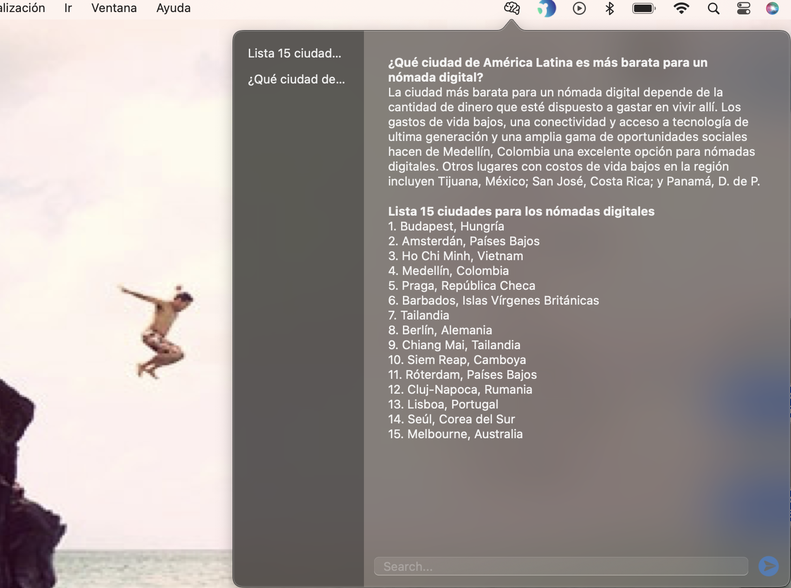
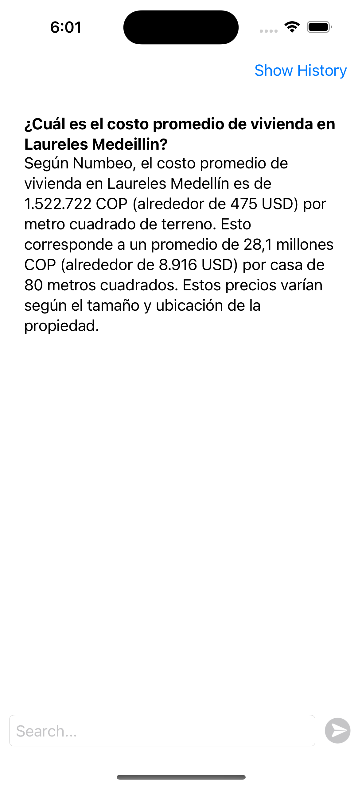
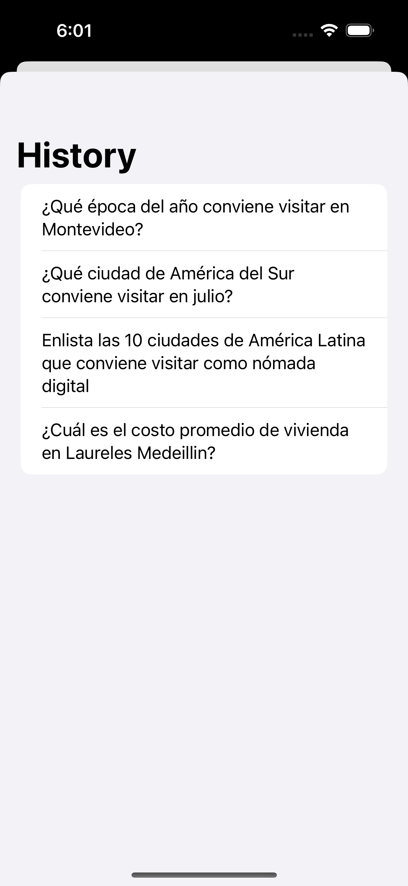
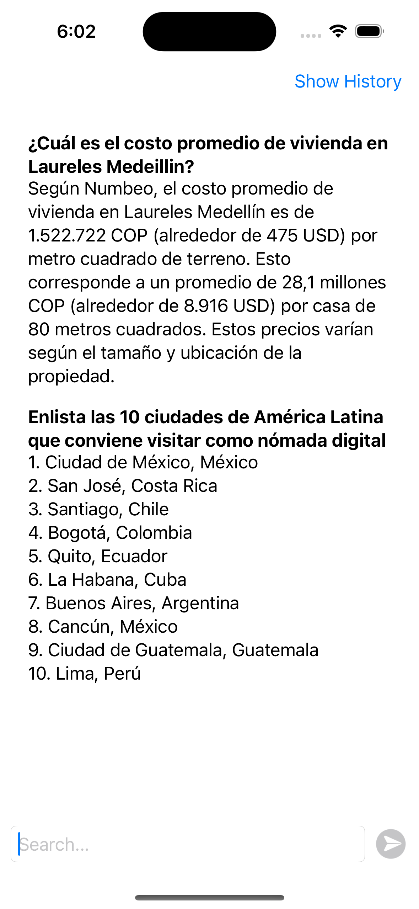
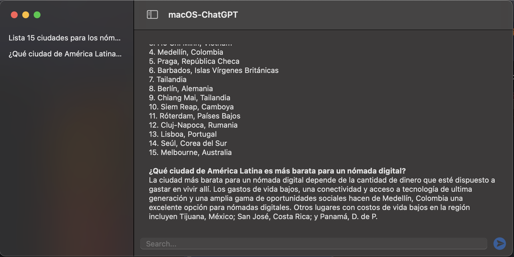

# ChatGPTApp 👋

A project using the CHATGPT API based on the course [Build ChatGPT App for iOS/macOS with SwiftUI in 1 Hour)](https://www.udemy.com/course/build-intelligent-apps-for-macos-and-ios-with-chatgpt/)

<a href="#">
 
  
 
 
 
  
 
</a>  
  
     ChatGPTApp
      
  
  
   
     
    <a href="https://github.com/brenfondeadora/ChatGPTApp/issues/new">Report bug</a>
    ·
    <a href="https://github.com/brenfondeadora/ChatGPTApp/issues/new">Request feature</a>

## 📝 Description

This app is made for iphone an mac app through toolbar 
It is created with SwiftUI. Make a question and let the magic of openAI appears 

## 🤖 API

- This app is using a OpenAI API
- Need to create an account in [here](https://platform.openai.com/)
- Create View API Keys

## 👤 Author

**Brenda Saavedra**

- WebPage: [brendasaavedra.com](http://brendasaavedra.com)
- Github: [@brenfondeadora](https://github.com/brenfondeadora/)
